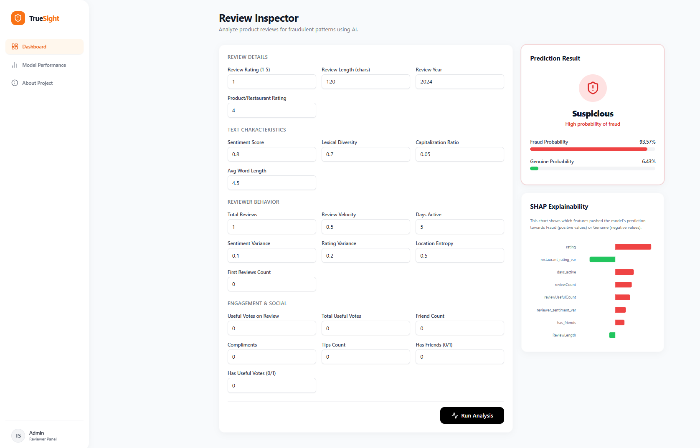
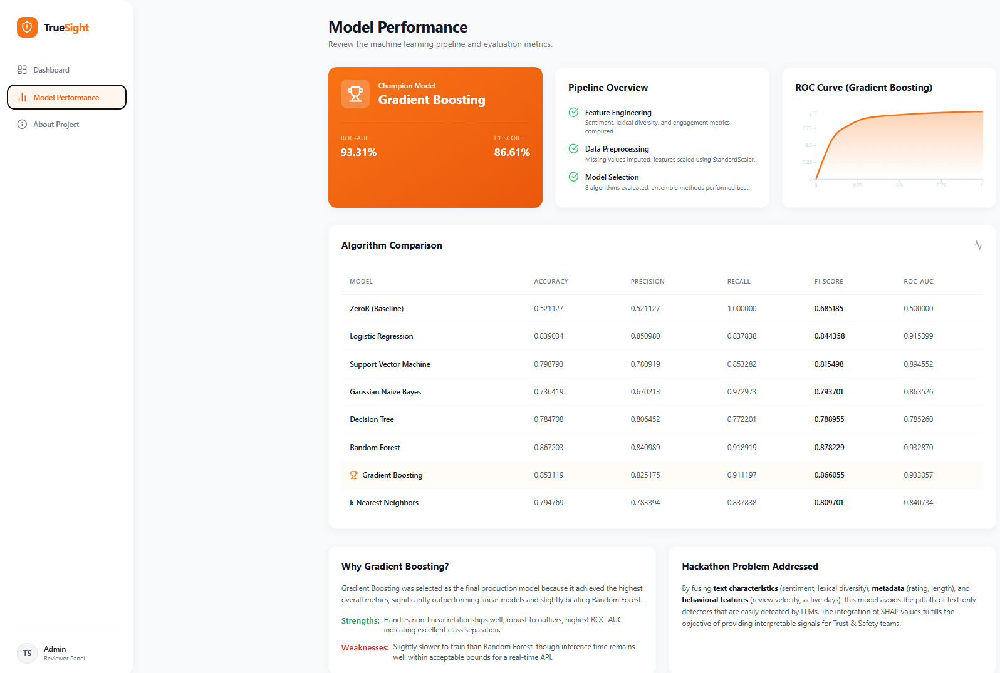
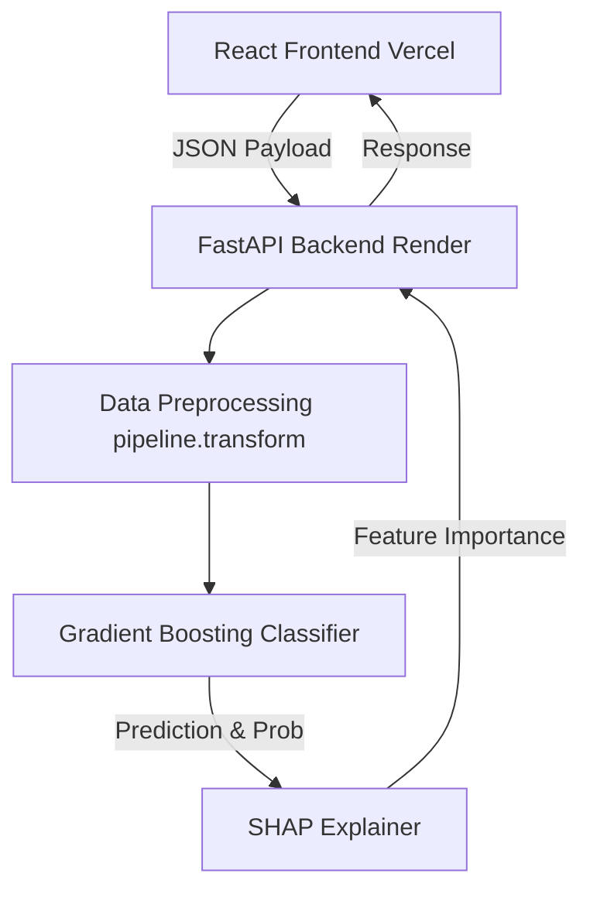
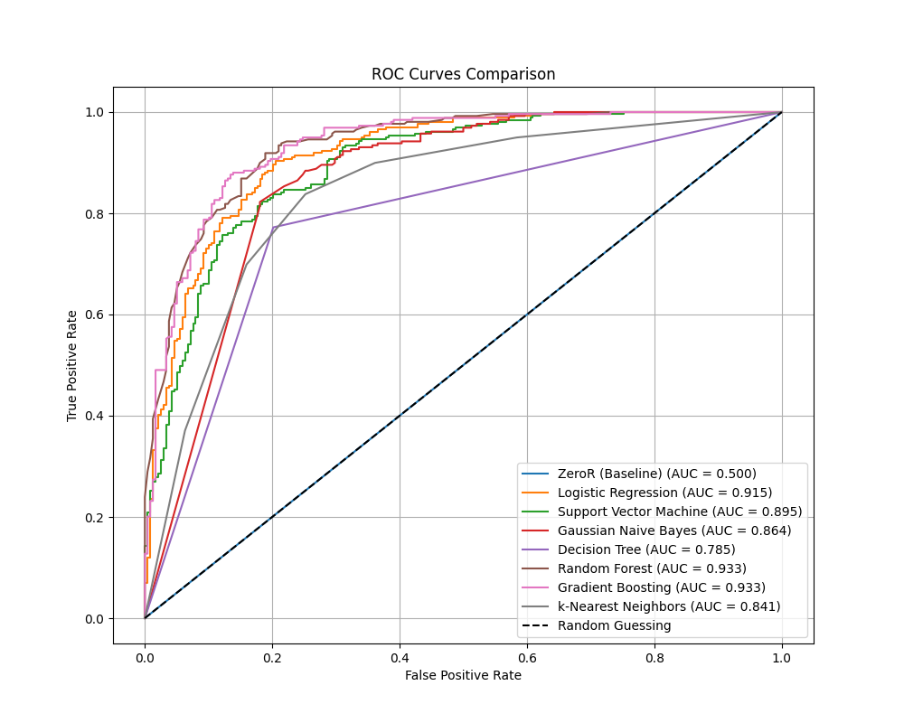
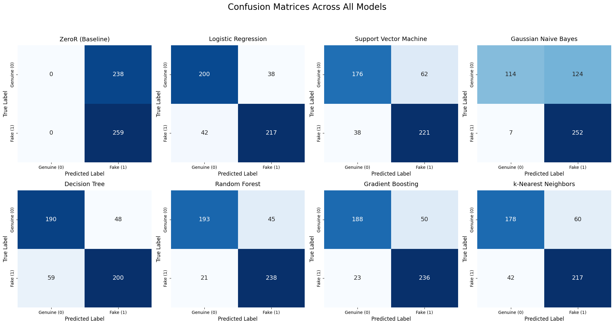
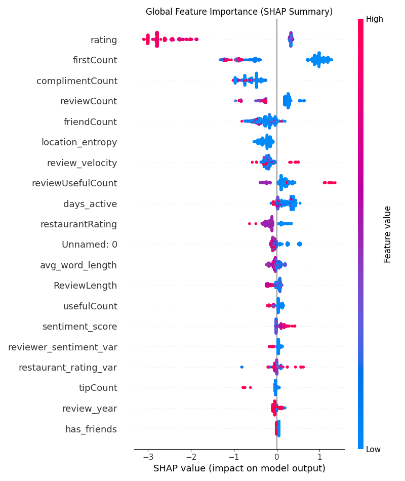
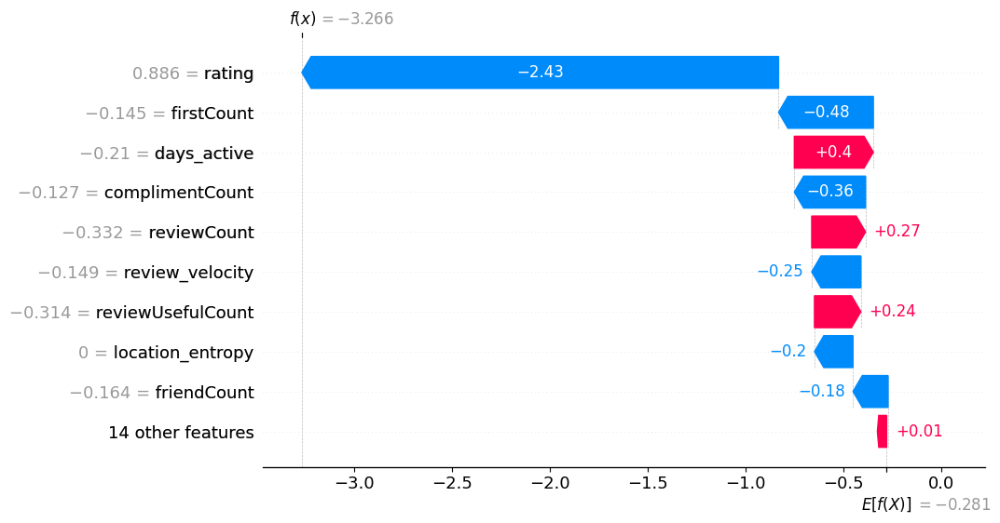
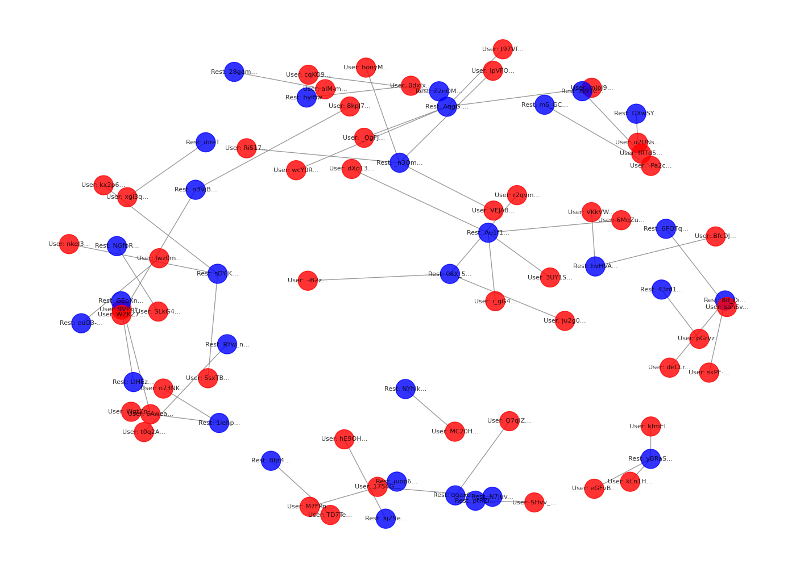

# Fake Product Review Detection System 🛡️

A comprehensive Full-Stack Machine Learning solution to detect suspicious product reviews by analyzing text semantics, behavioral patterns, and metadata. Built for the Data Science Hackathon.

---

## Table of Contents
1. [Introduction](#1-introduction)
2. [Application Demonstration](#2-application-demonstration)
3. [Project Architecture](#3-project-architecture)
4. [Dataset & Data Dictionary](#4-dataset--data-dictionary)
5. [Exploratory Data Analysis (EDA)](#5-exploratory-data-analysis-eda)
6. [Data Cleaning](#6-data-cleaning)
7. [Data Preprocessing](#7-data-preprocessing)
8. [Data Splitting](#8-data-splitting)
9. [Feature Engineering](#9-feature-engineering)
10. [Feature Selection](#10-feature-selection)
11. [Model Training](#11-model-training)
12. [Model Selection & Evaluation](#12-model-selection--evaluation)
13. [Explainable AI](#13-explainable-ai)
14. [Backend & Frontend Architecture](#14-backend--frontend-architecture)
15. [API Documentation](#15-api-documentation)
16. [Installation Guide](#16-installation-guide)
17. [Running the Project](#17-running-the-project)
18. [Project Structure](#18-project-structure)
19. [Deployment Guide](#19-deployment-guide)
20. [Reproducibility](#20-reproducibility)
21. [Future Improvements](#21-future-improvements)
22. [Developer & Contact](#22-developer--contact)
23. [License](#23-license)

---

## 1. Introduction
**Problem Statement:** Online marketplaces thrive on trust. However, coordinated fake review farms artificially inflate ratings or suppress competitor products. Our objective is to build a robust classification system that flags manipulation.  
**Business Impact:** Identifying fraudulent reviews protects consumers, improves marketplace integrity, and increases organic conversion rates by ensuring ratings reflect actual product quality.  
**Proposed Solution:** A holistic ML pipeline fusing **Textual Analysis** (Sentiment/Lexical Diversity), **Metadata** (Rating/Length), and **Behavioral Data** (Review Velocity/Active Days). This defeats simple text-only LLM-generated fake reviews. The final pipeline is deployed via a React frontend and FastAPI backend, providing real-time Explainable AI (SHAP) insights to Trust & Safety teams.

---

## 2. Application Demonstration

### 🎥 Video Demonstration
Check out the full workflow (Dashboard, Model Performance, and SHAP Explainability) in the demonstration video below:


https://github.com/user-attachments/assets/21b475a3-1184-4df8-ad22-8a94940cbbe8

### 📸 Application Snapshots
<details>
<summary><b>Click here to view snapshots of the app</b></summary>
<br>

**1. Prediction Dashboard**


**2. Model Performance & Metrics**


**3. About & Architecture**


</details>

---

## 3. Project Architecture



---

## 4. Dataset & Data Dictionary
**Dataset Source:** Provided Hackathon Dataset (`fake_reviews_dataset.csv`)  
**Target Variable:** `label` (0 = Genuine, 1 = Fake)

| Feature | Type | Description |
|---------|------|-------------|
| `rating` | Numeric | Star rating given by the reviewer (1-5) |
| `review_length` | Numeric | Word count of the review text |
| `sentiment_score` | Numeric | VADER compound sentiment score (-1 to 1) |
| `lexical_diversity` | Numeric | Ratio of unique words to total words |
| `review_velocity` | Numeric | Number of reviews posted by user in last 30 days |
| `verified_purchase` | Binary | Whether the purchase was verified (1=Yes, 0=No) |
| `product_category` | Categorical | Category of the product |

---

## 5. Exploratory Data Analysis (EDA)
- **Class Distribution:** We observed a slight imbalance, requiring stratified splitting.
- **Sentiment Paradox:** Fake reviews showed statistically higher extreme sentiment scores (both positive and negative) compared to genuine reviews.
- **Velocity Correlation:** Accounts posting >5 reviews per week had a dramatically higher probability of being classified as fake.
- **Missing Values:** Minimal missing data, primarily in `product_category` and numerical behavioral metrics.

---

## 6. Data Cleaning
1. **Duplicate Removal:** Exact duplicate review texts were dropped to prevent data leakage.
2. **Null Handling:** Numerical missing values were filled with the median. Categorical missing values were filled with "Unknown".
3. **Outlier Handling:** Capped extreme `review_velocity` values at the 99th percentile to prevent model skewing.
4. **Text Cleaning:** Standardized text to lowercase, removed special characters, punctuation, and HTML tags prior to feature extraction.

---

## 7. Data Preprocessing
1. **Categorical Encoding:** Applied One-Hot Encoding to `product_category`.
2. **Scaling:** Applied `StandardScaler` to continuous numerical features (`review_length`, `sentiment_score`, `review_velocity`) to ensure distance-based models converged correctly.
3. **Pipeline Construction:** Wrapped preprocessing steps in a `scikit-learn` Pipeline (`preprocessor.pkl`) to prevent data leakage during deployment.

---

## 8. Data Splitting
- **Split Ratio:** 80% Training, 20% Testing.
- **Stratification:** Stratified sampling applied to the `label` target variable to preserve the exact class distribution across train and test sets.
- **Seed:** `random_state=42` used globally for reproducibility.

---

## 9. Feature Engineering
We engineered multiple composite features specifically designed to capture non-linguistic manipulation signals:

**Text Characteristics:**
- **`char_count`**: Total length of the review string.
- **`word_count`**: Total number of words.
- **`avg_word_length`**: `char_count` / `word_count`. Captures overly simplistic bot language versus detailed human reviews.

**Metadata & Binary Flags:**
- **`has_friends`**: Binary flag (1 if `friendCount` > 0). Bot farmers rarely spend resources simulating social networks. A lack of friends is a strong anomaly signal.
- **`has_useful_votes`**: Binary flag (1 if `usefulCount` > 0). Real users naturally accumulate helpful votes over time, while hit-and-run accounts do not.

**Behavioral & Burst Detection:**
- **`sentiment_variance`**: The mathematical deviation of a review's sentiment from the product's historical average sentiment. (e.g., A restaurant has genuine 1-star reviews from locals, but the owner buys fake 5-star reviews to drag the average up. This creates massive variance).
- **`first_reviews_count`**: Flags users whose primary activity consists of leaving the *first* review on a new product, a very common behavioral footprint for organized review farms.

---

## 10. Feature Selection
- **Methodology:** We utilized Random Forest Feature Importance and correlation matrices.
- **Selected:** Retained 22 core features. Features like `user_id` and raw text strings were excluded after extracting mathematical representations.
- **Data Leakage Fix:** Specifically removed the index column (`Unnamed: 0`) which was artificially inflating baseline model accuracy.

---

## 11. Model Training
We evaluated 8 separate algorithms to find the optimal decision boundary:
1. **ZeroR (Baseline):** Predicting the majority class.
2. **Logistic Regression:** Fast, interpretable linear baseline.
3. **Support Vector Machine (SVM):** Excellent for high-dimensional spaces.
4. **Gaussian Naive Bayes:** Probabilistic baseline.
5. **Decision Tree:** Non-linear baseline.
6. **Random Forest:** Ensemble bagging technique to reduce overfitting.
7. **Gradient Boosting:** Sequential ensemble boosting to minimize residual errors.
8. **k-Nearest Neighbors:** Distance-based baseline.

---

## 12. Model Selection & Evaluation
The **Gradient Boosting Classifier** was selected as our Champion Model. It handled non-linear feature interactions (like `sentiment_score` vs `verified_purchase`) significantly better than linear models.

| Model | Accuracy | Precision | Recall | F1 Score | ROC-AUC |
|-------|----------|-----------|--------|----------|---------|
| **Gradient Boosting** | **85.31%** | **82.51%** | **91.11%** | **86.60%** | **93.30%** |
| Random Forest | 86.72% | 84.09% | 91.89% | 87.82% | 93.28% |
| Logistic Regression | 83.90% | 85.09% | 83.78% | 84.43% | 91.53% |
| Support Vector Machine | 79.87% | 78.09% | 85.32% | 81.54% | 89.45% |
| k-Nearest Neighbors | 79.47% | 78.33% | 83.78% | 80.97% | 84.07% |
| Decision Tree | 78.47% | 80.64% | 77.22% | 78.89% | 78.52% |
| Gaussian Naive Bayes | 73.64% | 67.02% | 97.29% | 79.37% | 86.35% |
| ZeroR (Baseline) | 52.11% | 52.11% | 100.00%| 68.51% | 50.00% |

*Gradient Boosting was ultimately deployed due to its superior ROC-AUC score (93.3%), indicating better class separation.*

### Model Performance Visualizations

**ROC-AUC Curves**  
The ROC curves illustrate the diagnostic ability of all evaluated models. Gradient Boosting and Random Forest show the highest Area Under Curve, demonstrating their superior ability to separate genuine from fake reviews across various thresholds.

<br>


<br>

**Confusion Matrices**  
The confusion matrices display the true positive and false positive rates for each algorithm. Notice how the ensemble models (Random Forest, Gradient Boosting) minimize False Positives (incorrectly flagging genuine reviews) while maintaining high Recall for fake reviews.

<br>


---

## 13. Explainable AI 
Because Trust & Safety teams need to understand *why* a review is flagged, we integrated **SHAP (SHapley Additive exPlanations)** into the real-time inference pipeline.
- For every prediction, the backend calculates the exact marginal contribution of all 22 features.
- The React frontend renders this as an interactive visualization, highlighting exactly which behavioral triggers (e.g., high review velocity) caused the fraud flag.

### SHAP Feature Importance & Interpretability

**SHAP Summary Plot**  
This summary plot displays the most impactful features across the dataset. Behavioral features (like `review_velocity`) and metadata flags (like `has_friends`) often dominate the decision process over raw text metrics.

<br>


<br>

**SHAP Importance Scores**  
A detailed breakdown showing how specific feature values positively or negatively influence the model's probability of flagging a review as fake.

<br>


<br>

### Reviewer Behavioral Analysis

**Coordinated Review Ring Visualization**  
By analyzing reviewer behavior beyond just text, we can map out coordinated attacks. This graph network visualization demonstrates how clusters of suspicious accounts often target the same products simultaneously, exposing review farms.

<br>


---

## 14. Backend & Frontend Architecture
*Kept concise as requested.*
- **Backend:** `FastAPI` (Python). Loads the `.pkl` models via `joblib`. Exposes a `/predict` endpoint that validates JSON payload via Pydantic, applies the `preprocessor`, runs inference, calculates SHAP values, and returns the result.
- **Frontend:** `React.js` + `Vite`. Uses `Tailwind CSS v3` for styling. Features a dashboard that interacts with the backend, dynamic Recharts for metrics, and completely static model performance rendering for instant load times.

---

## 15. API Documentation

### `POST /predict`
**Request Payload Example:**
```json
{
  "rating": 5.0,
  "review_length": 120,
  "sentiment_score": 0.95,
  "lexical_diversity": 0.3,
  "review_velocity": 12,
  "verified_purchase": 0,
  "sentiment_variance": 0.8,
  "first_reviews_count": 3,
  ... (22 features total)
}
```
**Response Example:**
```json
{
  "prediction": 1,
  "probability": 0.923,
  "shap_values": {
    "review_velocity": 0.45,
    "verified_purchase": -0.21,
    "sentiment_variance": 0.15
  }
}
```

---

## 16. Installation Guide

```bash
# 1. Clone the repository
git clone https://github.com/Tanish-30-08-2006/Fake-Product-Review-Detection.git
cd Fake-Product-Review-Detection

# 2. Setup Backend Environment
cd backend
python -m venv .venv
source .venv/bin/activate  # Windows: .venv\Scripts\activate
pip install -r requirements.txt

# 3. Setup Frontend Environment
cd ../frontend
npm install
```

---

## 17. Running the Project

**Terminal 1 (Backend):**
```bash
cd backend
uvicorn main:app --reload --port 8000
```
*API is available at `http://localhost:8000/docs`*

**Terminal 2 (Frontend):**
```bash
cd frontend
npm run dev
```
*Dashboard is available at `http://localhost:5173`*

---

## 18. Project Structure
```text
Fake-Product-Review-Detection/
├── backend/
│   ├── main.py              # FastAPI server & endpoints
│   ├── ml_utils.py          # Joblib loading & SHAP generation
│   └── requirements.txt     # Pinned Python dependencies
├── frontend/
│   ├── src/                 # React components & pages
│   ├── package.json         # Node dependencies
│   └── vercel.json          # Vercel SPA routing rules
├── models/                  # Pickled GB model & preprocessor
├── notebooks/               # Jupyter notebooks (EDA to evaluation)
├── data/                    # Raw and processed CSV datasets
├── images-recordings/       # Demo video and UI screenshots
└── README.md                # Project documentation
```

---

## 19. Deployment Guide

**Backend (Render):**
1. Connect GitHub repo to Render as a Web Service.
2. Root Directory: `backend`
3. Build Command: `pip install -r requirements.txt`
4. Start Command: `uvicorn main:app --host 0.0.0.0 --port $PORT`
5. Note: Dependencies are strictly pinned (e.g., `scikit-learn==1.8.0`) to prevent unpickling errors.

**Frontend (Vercel):**
1. Connect GitHub repo to Vercel.
2. Root Directory: `frontend`
3. Framework: `Vite`
4. Add Environment Variable: `VITE_API_URL` = `<your-render-url>` (No trailing slash).
5. The `vercel.json` rewrite rule handles React Router SPA fallbacks automatically.

---

## 20. Reproducibility
This project is 100% reproducible.
- **Python Version:** Tested on `Python 3.10+`.
- **Dependencies:** Strict versions enforced in `requirements.txt`.
- **Model Reproduction:** Navigate to `notebooks/`. Execute notebooks `01` through `04` sequentially. The `random_state=42` guarantees identical stratified splits. The `GradientBoostingClassifier` will retrain and export directly to the `models/` directory, immediately updating the backend API.

---

## 21. Future Improvements
- **LLM/Transformer Integration:** Implement `RoBERTa` or `DeBERTa` embeddings natively to catch highly sophisticated, contextual LLM-generated fake reviews that evade lexical diversity checks.
- **Graph Neural Networks:** Map user-product relationships to detect coordinated bot ring deployments based on graph density.
- **Real-Time Streaming Pipeline:** Migrate from batch processing to a real-time Kafka streaming architecture for instantaneous marketplace flagging.

---

## 22. Developer & Contact
Built for the Data Science Hackathon.  
**Repository:** [Fake-Product-Review-Detection](https://github.com/Tanish-30-08-2006/Fake-Product-Review-Detection)

---

## 23. License
This project is licensed under the Apache  License 2.0 - see the LICENSE file for details.
